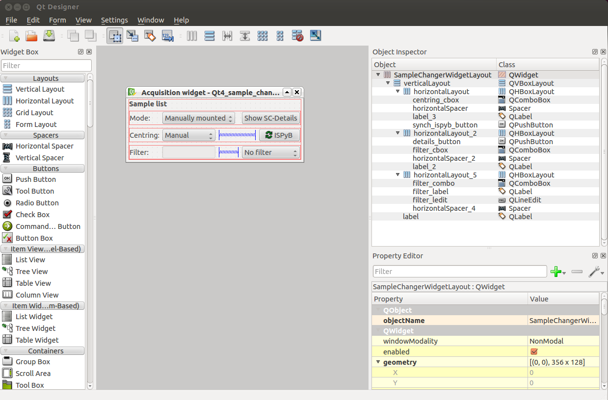
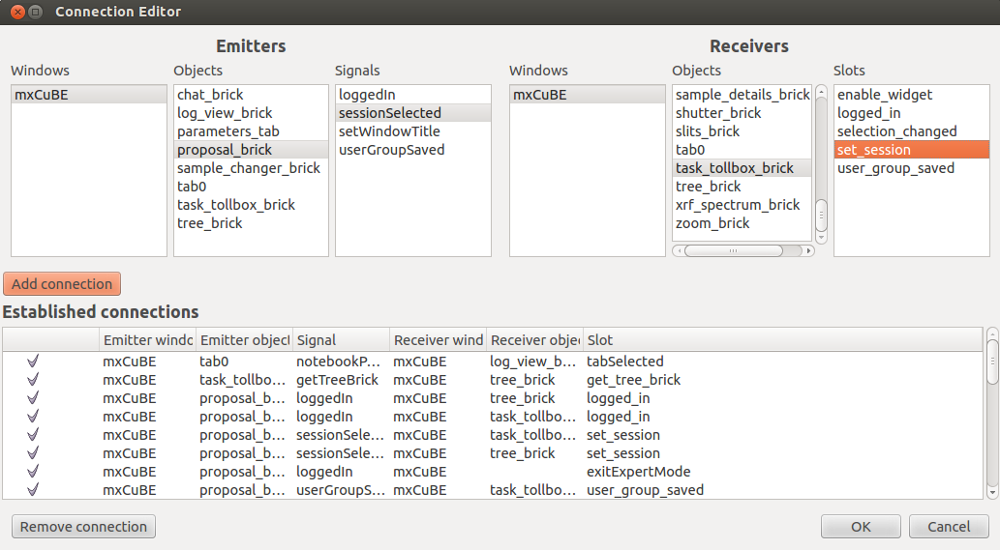

## How to create GUI brick in Qt version

* MXCuBE is based on building bricks that are linked together with GUI designer.
* Before creating and submiting a new brick to the git repository, please inspect [gui/bricks](https://github.com/mxcube/gui/tree/master/bricks)  directory if there is a brick that might fit to your needs.
* The main idea is to keep a commot graphical layout among many software users and try to keep optimal set of bricks.
* If it is necessary to create a new brick then use starting template and add necessary graphical elements:

```
   import QtImport

   from gui.BaseComponents import BaseWidget

   __category__ = "General"

   class ExampleBrick(BaseWidget):

       def __init__(self):
           BaseWidget.__init__(self)

           # Hardware objects ----------------------------------------------------
           self.test_hwobj = None       

           # Internal variables --------------------------------------------------
           self.test_internal_variable = None

           # Properties ---------------------------------------------------------- 
           self.add_property('mnemonic', 'string', '')  
           self.add_property('booleanProperty', 'boolean', False)
           self.add_property('stringProperty', 'string', 'initString')
           self.add_property('integerPropery', 'integer', 0)
           self.add_property('comboProperty', 'combo', ("combo1", "combo2", "combo3"), "combo1")

           # Signals ------------------------------------------------------------
           self.defineSignal("test_brick_signal", ())

           # Slots ---------------------------------------------------------------
           self.defineSlot("test_brick_slot", ())

           # Graphic elements ----------------------------------------------------
           self.test_ledit = QtImport.QLineEdit("Test linedit", self)
           self.test_button = QtImport.QPushButton("Test button", self)
           self.test_combo = QtImport.QComboBox(self)

           # Layout --------------------------------------------------------------
           _main_vlayout = QtImport.QVBoxLayout(self)
           _main_vlayout.addWidget(self.test_ledit)
           _main_vlayout.addWidget(self.test_button)
           _main_vlayout.addWidget(self.test_combo)
           _main_vlayout.setSpacing(2)
           _main_vlayout.setContentsMargins(2, 2, 2, 2)

           # SizePolicies --------------------------------------------------------

           # Qt signal/slot connections ------------------------------------------
           self.test_ledit.textChanged.connect(self.test_ledit_text_changed)
           self.test_button.pressed.connect(self.test_button_pressed)
           self.test_combo.activated.connect(self.test_combo_activated)
 
           # Other ---------------------------------------------------------------

```

### Pogramming guidelines

* Follow [Best practices](qt_framework_overview.md) when programming in Qt.
* `Hardware objects` defines used hardware objects. Use syntax `self.***_hwobj`.
* `Internal variables` defines internal variables (booleans, strings, integers, lists etc). Use reasonable variable names (for example: self.energy_limits_list clearly defines that variable is a list that contains energy limits) and assign None or a default value.
* In `Properties` section properties of the brick are defined. With GUI designer these properties are defined. They are stored in the gui file and preserved when MXCuBE is closed. Method `property_changed` is executed at the startup and can be used to read these properties.

```
   def property_changed(self, property_name, old_values, new_value):

        if property_name == "mnemonic":
            # property mnemonic is reserved for hardware objects
            # if there is a necessaty for more than one hardware object then
            # name the property based on hardware object (for example "energy")

            # disconnect signals if hwobj already exists

            if self.test_hwobj is not None:
                self.disconnect(self.test_hwobj, "testQtSignal", self.test_method)

            # with method get_hardware_object necessary hardware object is initialized
            # The value of the property should be the name of xml file that
            # contains the configuration of the hardware object.

            self.test_hwobj = self.get_hardware_object(new_value)

            # If hwobj is not initialized then function returns None

            if self.test_hwobj is not None:
                # If the hwobj is initialized then do necessary methods.
                # For example next line create qt signal/slot connection:
                # it binds "testQtSignal" of self.test_hwobj to self.test_method method
                # it means that when hwovj emits "testQtSignal" signal, self.test_method
                # will be called
                self.connect(self.test_hwobj, "testQtSignal", self.test_method)
            else:

                # If hwobj is not initialized then the brick is disabled
                self.setEnabled(False)
        elif property_name == "booleanProperty":
  
            # Do something with a boolean value
            pass
        elif property_name == "stringProperty":

            # Do something with a string value
            pass 
        elif property_name == "integerPropery":

            # Do something with an integer value
            pass
        elif property_name == "comboProperty":

            # combo style property is in a string type
            pass
        else:
            BaseWidget.property_changed(self, property_name, old_value, new_value)

```
   
* `Graphical elements` section is used to define all graphical elements.
* `Layout` defines brick layout. All Qt widgets are grouped within the brick based on `QHBoxLayout`, `QVBoxLayout` and `QGridLayout`. Use `addWidget` to add widget to the layout, `setSpacing` to set spacing between the qt widget, `setContentsMargins` to set the contents margins.
* `SizePolicies` define size policy (fixed size, expanding etc) of a widget.
* `Qt signal/slot connections` define signals/slots used within a brick. Here basic interations between basic Qt widgets are defined. Many Qt widgets have their own built in signals already implemented. For example, a QPushButton has (among others), a `clicked()` signal that can be connected to other widget/object's function to execute an action whenever it is emited. Example:

```
   self.test_ledit.textChanged.connect(self.test_ledit_text_changed)
   self.test_button.clicked.connect(self.test_button_pressed)
   self.test_combo.activated.connect(self.test_combo_activated)

   def test_ledit_text_changed(self, text_value):
       pass

   def test_button_pressed(self):
       pass

   def test_combo_activated(self, selected_index):
       pass
```

* `Other`. It is recommended to add all other code here. It is recommended to just define (not write additional code) GUI element in `Graphical elements` and then all necessary code define in `Other` section.

### Bricks based on widgets

It is recommended to use widgets to compose a brick. A widget in the MXCuBE context is a basic graphical element that has a defined function. Widgets are not bricks and can not be used as a stand alone brick via GUI designer. All widget are located in [widgets directory] (https://github.com/mxcube/mxcube/tree/master/gui/widgets)

In this example `dc_tree_widget.py` is used in  `TreeBrick`.

```
   class DataCollectTree(QtImport.QWidget):
         def __init__(self, parent = None, name = "data_collect",
                      selection_changed = None):
             """
             Descript. :
             """
             QtImport.QWidget.__init__(self, parent)
             self.setObjectName(name)
```

```
   # ...
   from widgets.dc_tree_widget import DataCollectTree
   # ...

   self.dc_tree_widget = DataCollectTree(self)
  
   # ...
   main_layout = QtImport.QVBoxLayout(self)
   # ...
   main_layout.addWidget(self.dc_tree_widget)
   main_layout.setSpacing(0)
   main_layout.setContentsMargins(0, 0, 0, 0)
```
   
### Bricks and widgets build by Qt Designer

Qt Designer is a powefull tool that allows to create layout for widgets and bricks. When many graphical elements are used then the layout management becomes difficult and it is easy to get lost. With Qt Designer a layout is designed and stored in ui file (see [ui files directory](https://github.com/mxcube/mxcube/tree/master/gui/ui_files>). This ui file is initialized and used via widget or Brick.

1. Use Qt designer to create layout and save ui file:



2. Intiate ui file with `QtImport.load_ui_file()` function and then use the generated object to get access to the components created on it:

```   
   # ...
   self.sample_changer_widget = QtImport.load_ui_file(
        "sample_changer_widget_layout.ui")

   # ...
   # Access ui widget by its name
   self.sample_changer_widget.details_button.clicked.connect(\
        self.toggle_sample_changer_tab)
   self.sample_changer_widget.filter_cbox.activated.connect(\
        self.mount_mode_combo_changed)
   self.sample_changer_widget.centring_cbox.activated.connect(\
        self.dc_tree_widget.set_centring_method)
   self.sample_changer_widget.synch_ispyb_button.clicked.connect(\
        self.refresh_sample_list)
```

In this case ui file is used in the brick. If it was used in the widget then remove `widget` from the ui file path.

### Signals and slots between bricks

* Use `Signals` and `Slots` to define interface and interactions between bricks. The only way how two separate bricks can communicate is via this signal and slot mechanism.
* Following [Qt's signal and slots system](https://doc.qt.io/qt-5/signalsandslots.html), any Qt object can send signals that can be connected to any object slots (simple member functions) to create interaction between them: when a signal is **emited** then the slot will execute.

For custom widgets, like user defined Bricks, custom signals can be created and then emitted.
See [PyQt Support for Signals and Slots](https://www.riverbankcomputing.com/static/Docs/PyQt5/signals_slots.html)

```
  
   # in the code use method "emit" to emit neccessary signal
   self.emit("testBrickSignal", value_to_send)

   # define method with slot name to receive emited value
   self.test_brick_slot(self, received_value):
        pass

```

In the GUI builder define signal/slot connection:



_**warning**_ : The number of variables emited via signal should much the number of variables received by a slot.

### See also

   * [Qt Home Page](https://www.qt.io/)
   * [Qt Examples And Tutorials](https://doc.qt.io/qt-5/qtexamplesandtutorials.html)
   * [Qt for Python, Qt Project page](https://wiki.qt.io/Qt_for_Python)
   * [PyQt Project page](https://www.riverbankcomputing.com/static/Docs/PyQt5/)
   
### Other information

* [How to create GUI brick](how_to_create_qt_brick.md)
* [How to define Qt GUI](how_to_define_qt_gui.md)
* [How to create Hardware Object](how_to_create_hwobj.md)

